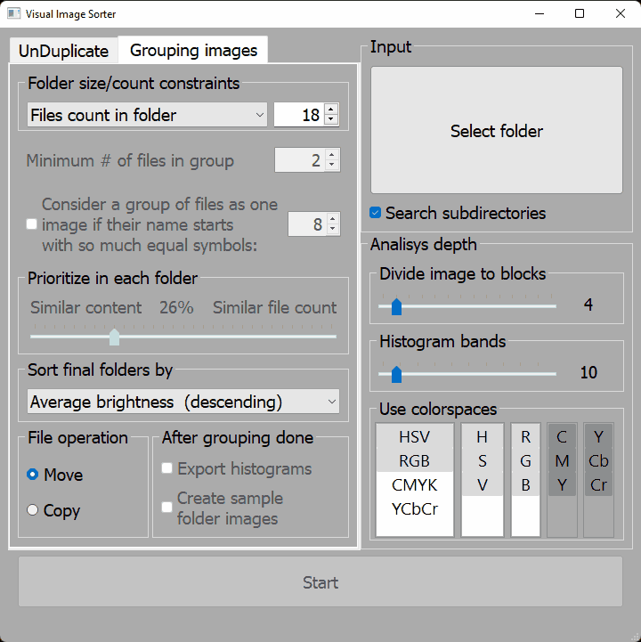

# VisImSorter
Python script to split images into folders

## General description
This program groups images into folders by similarity. Images which look alike are more likely to be grouped into one folder.
All images are compared by their histograms. Actual image content is never analyzed.

## Use cases
Say, you have a mix of a few thousand photos. And you want to get them organized at least in some way. After running VisImSorter you get all your photos grouped in folders with each folder containing a given number of similar photos.

## Supported image types
Initial version works with common image formats: jpg, png, jpeg, gif as well as raw formats, namely nef and dng. More formats will be added as needed.
If you want to try other formats yourself, try changing variable declarations of plain_file_types and raw_file_types inside ImageLoader.py.

## Author
Author is Dmytro Zheludko. 
zheludko@i.ua
facebook.com/Dimzhe

This program is not a new concept. It is a feature-reach rewrite of groupImg project by Victor Ribeiro. For original go to https://github.com/victorqribeiro/groupImg

## This readme
This document is incomplete. It will improve with time. Meanwhile feel free to contact to author if any questions arrive.
